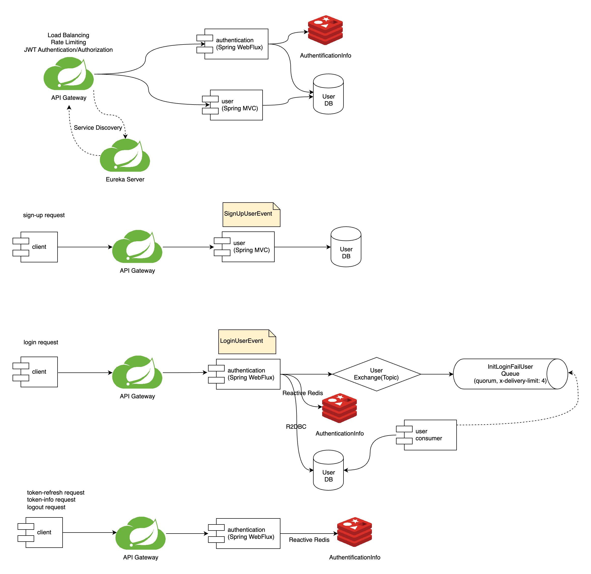

# api-gateway

### 개발환경
- Java 17
- Spring Boot 3.2.2
- Spring Cloud Gateway
- Spring Cloud Netflix Eureka Server
- Spring MVC [user]
- Spring WebFlux [authentication]
- Spring AMQP
- Spring Data Redis [authentication]
- Mybatis 3 [user]
- Gradle
- PostgreSQL 15.4
- Redis 7.2

### MODULE

### API
* Base Host 
  * Gateway 실행 시 http://localhost:9000
  * User http://localhost:9001
  * Authentication http://localhost:9002

[회원가입]
- POST http://localhost:9000/api/sign-up
    - -H ContentType: application/json
    - -H X-API-Key: QVBJLUtFWS1GT1ItTVNDLVVTRVI=

[로그인]
- POST http://localhost:9000/api/login
    - -H ContentType: application/json
    - -H X-API-Key: QVBJLUtFWS1GT1ItTVNDLVVTRVI=
    - -d '{"email": "value1", "password": "value2"}'

[토큰 갱신]
- POST http://localhost:9000/api/token
    - -H ContentType: application/json
    - -H X-API-Key: QVBJLUtFWS1GT1ItTVNDLVVTRVI=
    - -d '{"refreshToken": "value1"}'

[토큰 정보 조회]
- GET http://localhost:9000/api/token-info
  - -H Authorization: Bearer xxxxxx

[로그아웃]
- POST http://localhost:9000/api/logout
  - -H ContentType: application/json
  - -H Authorization: Bearer xxxxxx

[사용자 정보 수정]
- PUT http://localhost:9000/api/users/{userId}/profile
  - -H ContentType: application/json
  - -H Authorization: Bearer xxxxxx

[사용자 비밀번호 변경]
- PATCH http://localhost:9000/api/users/{userId}/password
  - -H ContentType: application/json
  - -H Authorization: Bearer xxxxxx

[사용자 탈퇴]
- DELETE http://localhost:9000/api/users/{userId}
  - -H ContentType: application/json
  - -H Authorization: Bearer xxxxxx

[사용자 조회]
- GET http://localhost:9000/api/users/{userId}
  - -H Authorization: Bearer xxxxxx

[사용자 목록 조회]
- GET http://localhost:9000/api/users
  - -H Authorization: Bearer xxxxxx

### 로컬 테스트 PostgreSQL
    # 볼륨 생성 (최초)
    $ docker volume create postgres_data

    $ docker run --name user-postgres -d \
    -v postgres_data:/var/lib/postgresql/data \
    -p 5432:5432 \
    -e POSTGRES_PASSWORD=asdf1234% \
    -e POSTGRES_USER=young \
    -e POSTGRES_DB=ys_local \
    postgres:15.4

### 로컬 테스트 Redis
    # 볼륨 생성 (최초)
    $ docker volume create redis_data

    $ docker run --name user-redis -d \
    -v redis_data:/data \
    -p 6379:6379 \
    redis:7.2-alpine

### 로컬 테스트 RabbitMQ
    # 볼륨 생성 (최초)
    $ docker volume create rabbitmq_data

    docker run --name rabbitmq -d \
    -v rabbitmq_data:/var/lib/rabbitmq \
    -p 15672:15672 \
    -p 5672:5672 \
    -e RABBITMQ_DEFAULT_USER=ysrabbit \
    -e RABBITMQ_DEFAULT_PASS=ysrabbit \
    rabbitmq:3-management
